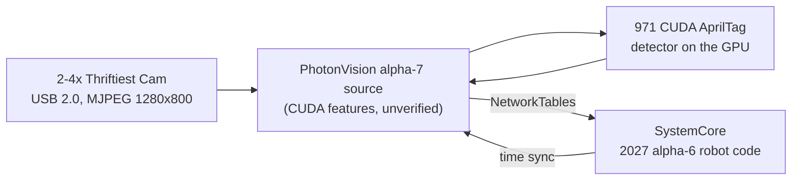

# SpectrumJetson: Jetson Vision Coprocessor Setup

How FRC 3847 / 8515 turned an NVIDIA Jetson Orin Nano Super into a GPU-accelerated AprilTag
vision coprocessor: what we built, why, and how to redo it. The detailed technical reference
(exact versions, commit hashes, every measurement) is in [docs/TECHNICAL.md](docs/TECHNICAL.md).

> 🎓 **Vision Training Course:** Check out our interactive, 17-chapter visual guide on how the Jetson vision system works at **[spectrum3847.github.io/SpectrumJetson](https://spectrum3847.github.io/SpectrumJetson/)**.

**Thank you, Austin Schuh.** The CUDA AprilTag detector at the heart of this build is Austin's work, first written for FRC 971 Spartan Robotics. He's the reason any of this works. He now develops it in [RealtimeRoboticsGroup/aos](https://github.com/RealtimeRoboticsGroup/aos) ([`frc/orin`](https://github.com/RealtimeRoboticsGroup/aos/tree/main/frc/orin)). We built from his copy in [frc971/bos](https://github.com/frc971/bos), inside [FRC-Team-4143's CUDA PhotonVision](https://github.com/FRC-Team-4143/photonvision). Full credits are at the [end](#credits-and-licenses).

Built by Spectrum 3847 with Claude Opus 5.5 (Anthropic) in Claude Code, which did the research, code, patches, tests and docs alongside the team.

*Last updated September 24, 2026.*

> **Experimental alpha-7 branch:** this branch ports the SpectrumJetson CUDA and Jetson features to
> PhotonVision source that targets WPILib `2027.0.0-alpha-7`. It has not passed a build on the target
> Jetson or a real robot-network test. Do not install it in place of the tested JetPack 6 image.
> See [CUDA13-MIGRATION.md](docs/CUDA13-MIGRATION.md) for the exact pins and acceptance checklist.

## Headlines

Measured on the bench:

- **2 AprilTag cameras at 120 fps each, full resolution (1280x800), about 15 ms latency, using about 25% of the CPU.** The cameras are Thrifty Bot [Thriftiest Cams](https://www.thethriftybot.com/products/thriftiest-cam): mono, global shutter, USB 2.0, $50 each. The GPU finds the tags in about 2 ms per frame and is only about 12% busy (peaks under 25%).
- **Set up for 4 AprilTag cameras** on the USB-A ports, plus a 5th camera on a USB-C hub (tested: all 5 streaming). All of them share one USB 2.0 budget, which 5 cameras fill.
- **Game-piece detection at 30 fps alongside the AprilTag cameras,** with no measurable slowdown to them (76 fps if uncapped). It found FUEL surprisingly well even on our mono camera.
- **Rewind:** robot code can record every camera at 30 fps, for 3% of one core, and you can download the recordings from the web UI.
- **Accurate timing:** frames are timestamped at mid-exposure and synced to the robot's clock.
- **Match-ready:**
  - detecting tags about 20 s after power-on
  - an unplugged camera is back in about 1 s
  - survives power cuts
  - restarts itself after errors
- **Works with stock PhotonLib** on a SystemCore (2027 alpha-2).

## Overview

We turned an NVIDIA Jetson Orin Nano Super into a vision coprocessor that finds AprilTags on its GPU, for team 8515's robot at the October 2026 off-season event.

The robot controller is a SystemCore running 2027 alpha-6 robot code. The Jetson runs PhotonVision, the same software many FRC teams use on an Orange Pi. Ours is a special version that sends the AprilTag math to the GPU using a detector written by FRC team 971. The robot code talks to it through PhotonLib over NetworkTables, like any other PhotonVision camera.

Everything we did is scripted in this repo, so another Jetson can be set up the same way. These notes explain what we did and why, including the mistakes, so you can understand the system and not just copy commands.

## How the pieces fit

A camera frame goes over USB into PhotonVision on the Jetson. PhotonVision finds tags with the CUDA detector on the GPU, then sends results to the robot over NetworkTables.



| Piece | What we use |
| --- | --- |
| Computer | Jetson Orin Nano Super devkit (8 GB), booting from a 256 GB NVMe SSD, no SD card |
| Operating system | JetPack 6.2.3 (Jetson Linux 36.5.2, Ubuntu 22.04) with CUDA 12.6 |
| Power mode | MAXN SUPER (the fastest mode, which gives the board its "Super" name) |
| Cameras | 2 Thrifty Bot [Thriftiest Cams](https://www.thethriftybot.com/products/thriftiest-cam) ([docs](https://docs.thethriftybot.com/electrical/thriftiest-cam/latest/overview)) for AprilTags: OV9281, mono, global shutter, 1280x800, USB 2.0. On the bench also: 2 "Global Shutter Camera" (32e4:0144) and a colour USB camera (32e4:62f0) for game pieces |
| Power | From the robot through a 15 V boost regulator board, which kept the Jetson running down to a 5 V input (tested 2026-09-25) |
| Vision software | PhotonVision source `1f419c9d` targets WPILib `2027.0.0-alpha-7`. The CUDA features are ported in this branch but remain unverified on Jetson. |
| Tag detector | Austin Schuh's current CUDA detector (from 971 / RealtimeRoboticsGroup), built from frc971/bos |
| Game pieces | YOLO models on the GPU through TensorRT 10.3 (our backend), FUEL model by Team 2826 |
| Robot side | Stock PhotonLib v2027.0.0-alpha-2 in `2026-FM-SystemCore`, team 8515 |

**Why a 2026 PhotonVision works with 2027 robot code:** the CUDA version of PhotonVision only exists for 2026. We checked the source to confirm the two versions speak the same language:

- the messages have the same format (PhotonLib compares a hash of the message layout, and it matches exactly),
- the NetworkTables protocol is the same,
- time sync is the same.

The one rule: **don't upgrade the robot's PhotonLib past alpha-6.** Newer versions changed the message format, and the robot code would crash when it reads from this Jetson.

## Step 1: Flash JetPack onto the SSD

Flashing writes NVIDIA's operating system onto the Jetson's NVMe SSD and updates the bootloader stored on the board. It's done from an Ubuntu 22.04 laptop over a USB-C cable. The whole flash took about 7 minutes.

**Why JetPack 6.2.3 and not 7:** JetPack 7 now supports this board, but it moves to Ubuntu 24.04 and CUDA 13. The CUDA detector and PhotonVision fork were built for JetPack 6. 6.2.3 was the newest 6.x release, with bug fixes over the 6.2 in our original plan.

1. **Download** the two NVIDIA files, the "BSP" (flashing tools) and the "sample root filesystem" (Ubuntu itself), about 2.6 GB.
2. **Prepare** them on the laptop: `scripts/host/01-prepare-bsp.sh`. It unpacks everything and installs NVIDIA's flashing prerequisites. It also creates the Jetson's user account (`spectrum3847`, hostname `photonvision-3847`), so the first boot doesn't need a monitor and keyboard.
3. **Put the Jetson in recovery mode:**
   - Unplug power.
   - Jumper the **FC REC** and **GND** pins (pins 9 and 10) on the small 12-pin button header under the module. It's *not* the big 40-pin header.
   - Plug power back in, then remove the jumper.
   - Check with `lsusb`: the Jetson should show up as `0955:7523 NVIDIA Corp. APX`.
4. **Flash:** `scripts/host/02-flash-nvme.sh`. The script temporarily stops Ubuntu's network manager from grabbing the Jetson's USB network connection, and temporarily opens the firewall for it. Both are common causes of failed flashes, and both are put back afterward.

**Reading the flash log:** "Waiting for target to boot-up" repeating for about 30 s is normal, and so are warnings like "backup GPT table is corrupt" and missing `mmcblk0boot0`. The flash is only finished at **"Flash is successful"**. "Successfully flashed the external device" comes a couple of minutes earlier, and the bootloader is still being written at that point, so **don't unplug the board then.**

## Step 2: First boot and verification

After flashing, the Jetson boots from the SSD and shows up on the laptop as a USB network device. The Jetson is `192.168.55.1`, and the laptop gets `192.168.55.100`.

1. **Set up SSH keys** so scripts can log in without a password: `ssh-copy-id -i ~/.ssh/jetson_ed25519.pub spectrum3847@192.168.55.1`.
2. **Verify and enable MAXN SUPER:** `scripts/jetson/01-verify.sh` checks three things. The root filesystem must be on the NVMe (`/dev/nvme0n1p1`), the software version must be R36.5.2, and the MAXN SUPER power mode must exist. It then switches to that mode (`nvpmodel -m 2`). Afterward, all 6 CPU cores run at 1728 MHz, and the setting survives reboots.
3. **Get it online.** Over USB it has no internet, and its clock is wrong until it syncs, which makes package downloads fail. Wi-Fi is easiest: `sudo nmcli --ask dev wifi connect <SSID>`.
4. **Install CUDA** with `scripts/jetson/02-jetpack.sh`, which runs `apt install nvidia-jetpack`. Flashing only installs the base OS, so CUDA 12.6, cuDNN and TensorRT come from this step.

**Tip:** never put a password in a script or a chat. On our Jetson the team account has passwordless sudo (`/etc/sudoers.d/90-spectrum3847-nopasswd`, added by the team so setup scripts can run over SSH); on a fresh Jetson, run `sudo` steps in a terminal where you type the password yourself.

## Step 3: Build and install the vision software

The vision stack has four parts. Two are built on the Jetson, one on the laptop, and one is installed from PhotonVision's installer.

| # | Part | Built where | Script | Notes |
| --- | --- | --- | --- | --- |
| 1 | PhotonVision service | Jetson (installer) | `jetson/03-photonvision.sh` | Installs the systemd service that starts PhotonVision at boot. |
| 2 | allwpilib `v2027.0.0-alpha-7` | Jetson | `jetson/04-build-allwpilib.sh` | Fetches the exact tag object and commit used by the alpha-7 source. This has not been built on the target Jetson. |
| 3 | CUDA detector `lib971apriltag.so` | Jetson | `jetson/07-build-bos-detector.sh`, then `08-select-detector.sh bos --mwbd 20 --jpeg nvjpg` | Austin Schuh's current code (see below) plus our JNI wrapper in `detector/`. `--jpeg nvjpg` decodes the camera JPEGs on the Jetson's JPEG hardware (`libspectrumnvjpg.so`, see Performance), gray and colour; it uses ~180 MB of memory per camera. Leave it out to decode on the CPU. |
| 4 | PhotonVision alpha-7 jar | Laptop | `host/03-build-photonvision-fork.sh`, then `jetson/06-install-fork-jar.sh` | Applies `patches/photonvision-2027-alpha7-migration.patch` to an exact source commit and runs on Java 25. Real Jetson and robot-network tests are still required. |
| 5 | Camera driver with a bandwidth cap | Jetson | `jetson/11-uvcvideo-payload-cap.sh --install` | Needed for 3–4 cameras on the USB-A ports (see Performance). |
| 6 | TensorRT backend `libspectrumtrt.so` | Jetson | built by `07-build-bos-detector.sh`; install to `/usr/lib` | Game-piece detection. Models go in with `jetson/12-install-yolo-model.sh`. |
| 7 | USB controller watchdog | Jetson | `jetson/14-usb-watchdog.sh --install` | Resets the USB controller if the kernel says it died, so the cameras come back without a person. It never reboots (see Known issues). |

**Where the detector code comes from.** FRC 971 (Spartan Robotics) wrote the CUDA AprilTag detector. Austin Schuh, its author, now maintains it in the [**RealtimeRoboticsGroup/aos**](https://github.com/RealtimeRoboticsGroup/aos) repo and works with team 1868. We started with FRC-Team-4143's copy (`GpuDetectorJNI`), which dates from about August 2024. We switched to **frc971/bos**, which has Austin's current code with a CMake build that works on our exact CUDA version. In a side-by-side test, the new detector found tags exactly as well as the old one, and **30–40% faster** (1.7 ms per frame instead of 2.4–3.0 ms).

**Why build on the laptop sometimes?** The fork's jar is Java plus a web UI, with no native code, so it builds the same anywhere. The detector and allwpilib are native ARM and CUDA code, so they have to be built on the Jetson itself (or cross-compiled, which is more work).

**Safe deploys.** `06-install-fork-jar.sh` refuses to install a jar that isn't a valid zip, and it keeps the previous working jar as `photonvision.jar.prev`. We added that after a truncated jar took PhotonVision down (see the bugs section).

**Robot readiness.** `jetson/09-robot-tuning.sh` prepares the Jetson for the robot: no automatic updates, headless boot, snapd off (it was adding 45 s to every boot), clocks locked at max on boot, USB autosuspend off for cameras, power-cut safety (data on the SSD within 3 s, the system log kept across power cuts), the fan at full speed, a 30 s hardware watchdog (also while rebooting, where it was 10 minutes), reboot on kernel panic, PhotonVision restarted on any exit, OpenCV's worker threads sleeping instead of spinning, and 1 s USB retries (a stuck camera held up the others on its hub for ~65 s each). The system log keeps up to 2 GB. After it, the Jetson boots in 16.5 s instead of 57 s, and both cameras are detecting about 20 s after power-on. `jetson/health-check.sh` prints a PASS / WARN / FAIL readiness report you can run over SSH before a match.

## Bugs we found and fixed

None of this code was written for our exact setup, so we found and fixed several real bugs. Each fix is a small patch file in `patches/`, applied automatically by the build scripts. They're good examples of how real systems fail.

| Bug | What went wrong | Fix |
| --- | --- | --- |
| Memory leak | The detector leaked two small matrices every time it decoded a tag. Over a long event it could run the Jetson out of memory. | Applied Austin's upstream fix (`3e570d5a`). |
| Detector slots | The C++ code had 10 detector slots and never reused them. The 11th pipeline change got handle `-1` and then read past the start of an array, which is undefined behavior. | Reuse slots, check every handle, free detectors properly (`gpudetector-03`). A stress test creates and destroys 300 detectors. |
| Stale CUDA error | CUDA's error flag stays set until someone reads it. Newer CUDA libraries (CUB) fail on *any* leftover error, so one unchecked call broke a later, unrelated call on every frame. | Clear leftover errors before each frame, and check the calls that weren't checked. |
| One GPU error crashed everything | Austin's code aborts the whole program on any CUDA error, which takes PhotonVision down with it. | A CUDA error now skips one frame. PhotonVision restarts only if the whole GPU context is broken (`cudaDeviceSynchronize` fails for 1 s); a failure on one camera never takes the others down (`bos-01` + `detector/`). |
| Blank frames failed every time | With nothing to detect (covered lens, dark pit, plain wall), the detector launched a GPU kernel with 0 blocks, an invalid launch that broke the next step on every frame. Combined with the old watchdog, that restarted PhotonVision in a loop. | Return "no detections" early when there are no candidate blobs (`bos-02`). Reproduced and verified with `tests/detector-frame-sizes`: blank frames failed at 5 resolutions before, pass at all of them now. |
| 62-second restart | Aborting triggered Ubuntu's crash reporter, which spent 28 s writing a 156 MB crash file before the restart could begin. | Exit cleanly instead, and turn off JVM core dumps. Worst-case vision outage went from about 62 s to about 8 s. |
| Blank AprilCudaTag tab | The fork's settings tab was written for an older version of the web framework (Vue 2) and couldn't render in Vue 3. | Ported it to Vue 3, showing only settings that actually do something (`photonvision-01`). |
| Missing Device Control card | PhotonVision used a brand-new browser feature (`Intl.DurationFormat`) to format the uptime. Firefox 130 doesn't have it, so the whole card, including the Restart button, disappeared. | Check for the feature and fall back (`photonvision-03`). Also: keep your browser updated. |
| Truncated jar | A deploy copied a 228 KB piece of a 76 MB jar. PhotonVision couldn't start, and systemd gave up after 5 tries. | The install script now refuses invalid jars and keeps the previous working one. |
| Colour decode hiding in cscore | Asking cscore for grayscale frames still decoded each JPEG to full colour first, then converted it: 8.9 ms a frame, most of a CPU core per camera. | We decode the camera's JPEG straight to gray in our detector library (`photonvision-09`): 2.6 ms. Both cameras went to 122 fps and CPU fell from 3.3 to 1.3 cores. |
| A camera silently stuck at 320x240 | At about 1 in 20 PhotonVision starts, cscore's own "restore the video mode" on connect raced PhotonVision's and left TopRight streaming 320x240, while cscore believed 1280x800. Our fast decoder saw the size mismatch, gave up after 30 frames (0.25 s), and fell back to cscore, which upscaled the 320x240 frames to 1280x800. Detection kept running at 122 fps on a blurry, stretched image: less range, 1.7 CPU cores instead of 0.5, and no error anyone would notice. | `photonvision-27`: a size mismatch never falls back. The frame is dropped, and after 1 s the camera is closed and reopened, so cscore applies the mode again. Setting the same mode again does nothing in cscore. Real decode failures still fall back, but it's retried every 10 s instead of until the next restart. The health check now fails any camera whose actual format isn't what PhotonVision set. |
| Frozen frames from the JPEG hardware | The Jetson has hardware for decoding JPEGs. The obvious way of calling NVIDIA's library, the way another FRC codebase does it, returned the *first* frame over and over, and reported success every time. A speed test looked great. | We found it by checking every decoded frame against the CPU decoder, pixel for pixel. We call the library differently now (`detector/NvJpgDecoder.cc`), and while running, one frame per camera every 2 s is re-decoded on the CPU and compared. Any difference switches the hardware off (`tests/jpeg-hw/run.sh` repeats the full check). |
| A memory leak in NVIDIA's JPEG library | NVIDIA's JPEG library leaked about 250 KB on every frame unless it's put in its "MJPEG" mode, which NVIDIA's own example code does but doesn't explain. PhotonVision grew to 5.6 GB within minutes, and Linux killed it twice. Our tests had only ever run for a minute at a time, so they never noticed. | One setting (`mjpeg_decode`) fixed it: memory now stays flat (8 minutes and ~116,000 frames measured). The test now fails if memory grows, and `health-check.sh` warns if PhotonVision uses over 2.5 GB or was killed for running out of memory. **Lesson: run new code for a long time and watch its memory, not just its speed.** |
| Lens model cut short | Calibration produces 8 lens-distortion numbers, but the fork only passed the first 5 to the CUDA detector. The detector uses them to straighten tag edges when it refines corners, so corners near the image edges came out slightly wrong. | A new `setparams8` call passes all 8 (`photonvision-04` + `detector/`). The log now shows "(8 dist coeffs)" for each camera. |

**Lesson:** check results by *measuring*, not by assuming. The truncated-jar bug happened partly because we trusted a log line from the *old* process. Now every check looks at the running process's own ID.

## Performance: what actually limits the frame rate

We went from 33 fps to the cameras' full **122 fps**, on two cameras at once. The GPU was never the bottleneck: the detector takes under 2 ms per frame, fast enough for 500+ fps. The real limits were the camera exposure, how PhotonVision reads frames, and how it decodes them.

| Change | FPS (1 camera) | Latency | Why it mattered |
| --- | --- | --- | --- |
| Starting point (exposure 295) | 33 | 44 ms | Exposure was 29.5 ms per frame, which caps the frame rate at 34 fps |
| Exposure 83 (8.3 ms) | 61 | 20 ms | The camera can now deliver 120 fps. PhotonVision became the limit |
| Ask cscore for grayscale frames | 62 | 18 ms | Same fps, but Java CPU dropped from 155% to 111% of a core. (Only half the fix: see below.) |
| Low Latency Mode **off** | ~100 | 18 ms | PhotonVision stopped waiting for each frame and missing every other one |
| Two cameras, all of the above | 92 and 104 | ~23 ms | Used 3.3 of 6 CPU cores |
| **Decode the JPEG straight to gray ourselves** (`photonvision-09`) | **122 each** | **13 ms** | cscore was secretly decoding every frame to full colour, then converting (8.9 ms a frame). Our decoder does gray only (2.6 ms). |
| OpenCV's worker threads sleep instead of spin (tuning step 9) | 122 each | 13 ms | 2 cameras now use **1.3 of 6 cores**, down from 3.3 |
| **Decode JPEGs on the Jetson's JPEG hardware** (`--jpeg nvjpg`) | 122 each | not measured | On the same bench scene, back to back: PhotonVision went from 0.85 to **0.52 cores**. The hardware takes ~2.6 ms a frame whatever the scene; the CPU decoder is faster on plain scenes and slower on busy ones. |
| Dashboard stream only while someone is watching, at most 30 fps (`photonvision-15`) | 122 each | not measured | With no browser open, PhotonVision went from 0.49 to **0.43 cores**. It used to shrink, colour-convert and draw every frame for a stream nobody was watching. |
| Colour frames on the JPEG hardware too (`photonvision-18`) | 120 (colour) | not measured | One colour camera at 120 fps (driver mode) beside an AprilTag camera: PhotonVision went from 1.12 to **0.59 cores**. The pixels are identical to cscore's own decode. |

**Exposure units are a trap.** USB cameras count exposure in the UVC standard's **100 µs units**, so 295 means 29.5 ms, not 0.3 ms, and stock PhotonVision doesn't say so. We only found this by reading the camera's control directly with `v4l2-ctl`. Our build now shows milliseconds on the slider, e.g. "Exposure (5.0 ms)" (`photonvision-10`).

**Shorter exposure, lower cutoff.** Shorter exposure means less motion blur, but a darker image and a lower **decision margin** (how confidently a tag decoded): about 44 at 3 ms, about 118 at 8.3 ms. PhotonVision drops tags below its cutoff, 35 by default. We run **exposure 50 (5 ms) with the cutoff at 15**. The detector still finds real tags, and tag36h11 at Hamming distance 0 almost never gives false positives.

**Lights flicker.** Mains lighting flickers 120 times per second (every 8.3 ms). At exposures that aren't a multiple of 8.3 ms, each frame can catch a different part of the flicker and pulse in brightness. In our shop at 5 ms we measured no flicker (0.6% brightness change frame to frame) with `tests/flicker-check/run.sh`. **Run it again under the event's lights; if frames pulse by several percent, go back to 83 (8.3 ms).**

**Measure before optimizing.** We added a once-per-second stats line to the detector (calls per second, milliseconds per frame, tags per frame, decision margin). It showed right away that the GPU was idle and the camera pipeline was the problem, which saved us from optimizing the wrong thing.

**Four cameras share one GPU.** With 4 cameras the GPU is only about a third busy, yet the slowest frames take 6–12 ms instead of ~3. That's queueing: a camera's GPU work sometimes waits behind another camera's, like a short line at a busy store. We tried two settings to shorten the wait: 32 hardware work queues for CUDA instead of 8, and letting the CPU sleep while the GPU works instead of spinning. The first test made the queues look like a big win, but repeating it showed the same settings vary by 2 ms from one restart to the next. Over 11 runs the queues were worth maybe 0.5 ms, and sleeping made no difference. Both are on anyway because neither costs anything (`08-select-detector.sh` sets the queues; details in [TECHNICAL.md](docs/TECHNICAL.md)). **Lesson: measure more than once before believing a speed-up.** Also close the dashboard before measuring: 4 open camera streams added about half a CPU core and 1–2 ms to the slowest frames.

**More cameras.** Each camera at its full 122 fps now costs about 0.6 of a CPU core (it was 1.4 before the decode fix), and less with the JPEG hardware, so 4 cameras should fit. The limit was **USB bandwidth**. With the stock driver each camera reserves ~196 Mbps whatever mode it runs, and the Jetson's whole USB 2.0 side holds two of those (see below).

We fixed that with a patched camera driver (`scripts/jetson/11-uvcvideo-payload-cap.sh`). It caps the Thriftiest Cam's reservation at 82 Mbps (UVC alternate setting 7), still about 1.4x the largest frame we've measured at 120 fps. Now **4 cameras fit on the USB-A ports**, plus a 5th capped at 1600 bytes on a USB-C hub. Tested with 2 cameras: 122 fps each, every frame complete. The cost: a 50 KB frame takes ~4.9 ms to cross USB instead of ~2 ms, so results reach the robot ~2 ms later. It does **not** make timestamps less accurate: the driver stamps a frame when its *first* USB packet arrives. Java's memory isn't a concern: the heap peaked at 28 MB with zero garbage collections in 20 s.

**There is only one USB 2.0 bus. The USB-C port doesn't add bandwidth** (measured 2026-09-24). The Jetson has one USB controller, with one USB 2.0 bus (`lsusb` Bus 1) and one USB 3 bus (Bus 2). Every USB 2.0 port is a branch of Bus 1 and shares its budget:
- the four USB-A ports (one hub inside the Jetson);
- the USB-C port;
- the M.2 Key E slot (the Wi-Fi card's Bluetooth).

We tested by setting cameras' USB alternate settings directly, with PhotonVision stopped. The bandwidth figures are bytes reserved per 125 µs microframe.

| Reserved | Where | Result |
| --- | --- | --- |
| 6120 | two uncapped cameras on USB-A (3060 + 3060) | fits |
| 6132 | 3072 on USB-C + 3060 on USB-A | fits, but a second 3060 on USB-A is then refused |
| 6720 | four at 1280 on USB-A + 1600 on USB-C | fits (what we run) |
| 7400 | 3060 + 3060 + 1280, all on USB-A | refused |
| 7520 | four at 1280 on USB-A + 2400 on USB-C | refused |

So about **6700 bytes fit, whichever ports the cameras are on** (about 430 Mbps). With 4 cameras at 1280 and a 5th at 1600 it's full: a 6th USB 2.0 camera needs lower caps (check each camera still holds its frame rate), or one of these:
- **A USB 3 camera:** it streams on Bus 2, the USB 3 bus, which has its own budget. The USB-A ports are USB 3.2, and so is USB-C.
- **A USB controller card in the spare M.2 slot:** a second controller gives a second USB 2.0 bus.
  - **The slot:** the Orin Nano dev kit has an empty M.2 Key M 2230 slot, PCIe 3.0 x2 ([NVIDIA's hardware layout](https://docs.nvidia.com/jetson/orin-nano-devkit/user-guide/latest/hardware_layout.html), mark 11). The 2280 Key M slot holds our SSD.
  - **Drivers:** Key M slots carry only PCIe, not USB, so this needs a PCIe-to-USB controller card. The Jetson's kernel has the drivers (`xhci-pci`, plus the Renesas firmware loader).
  - **Untested:** most such cards are 2280 or need a riser, and the new ports must be mounted on the robot.
  - **Not the Key E slot:** its USB is Bus 1 again, and it holds the Wi-Fi card.

**The Camera Matching page shows all of this** (`photonvision-32`). A **USB bandwidth** card at the top draws the shared budget as a bar, one colour per camera, with what each actually sends filled in. Per camera it shows:
- **FPS** and **Using:** what the camera really sends, in MB/s and as a share of its allocation. At 90% or more it says "squeezed" (see below).
- **Largest frame:** the biggest recent frame, how many times it fits in one frame time at the camera's allocation ("fits 1.4x"), and how long it takes to cross USB.
- **Allocation:** what it reserves. Pick another from the list to change it:
  - it's saved for the next boot;
  - the camera is reset, like a replug, to apply it: about 2 s without frames;
  - choices that would go over the budget are greyed out, so to give one camera more, lower another first.

Each camera's card also gets a line like "USB bandwidth: 3.4 of 10.2 MB/s (port 1-2.4)".

**What if a camera needs more than its allocation?** It can't take more: the USB host lets it send only that many bytes per 125 µs. Its allocation is also guaranteed, so one camera never takes another's.

We tested what the camera itself does by giving two cameras less than they were sending (2026-09-24). Both kept their frame rate and compressed harder instead:

| Camera | Allocation | fps | Average frame | Frame time on USB | Slots in use |
| --- | --- | --- | --- | --- | --- |
| TopRight (Thriftiest) | 1280 B (10.2 MB/s) | 121 | 47.5 KB | 4.6 ms | — |
| TopRight | 640 B (5.1 MB/s) | 121 | 40.8 KB | 8.0 ms | 97% |
| Colour USB Camera, 640x480 | 256 B (2.0 MB/s) | 30 | 36.6 KB | 18 ms | 76% |
| Colour USB Camera | 128 B (1.0 MB/s) | 30 | 31.5 KB | 31 ms | 96% |

So a squeezed camera:
- sends lower-quality JPEGs, which may cost AprilTag range and precision (not yet measured with tags);
- adds latency, because each frame takes longer to cross USB.

We haven't pushed a camera so far that it drops frames.

**Choosing an allocation:**
- **AprilTag cameras:** keep them out of "squeezed" (under 90%), with "fits" at 1.3x or more.
- **The cost of going smaller:** latency. A 60 KB frame takes 5.9 ms to cross USB at 1280 bytes, and 8.0 ms at 944.
- **Slower cameras** have room to spare: a 30 fps game-piece camera or a 60 fps camera usually fits 2–6x.

The numbers come from our camera driver, which counts each camera's bytes and largest frames (`kernel/uvcvideo-payload-cap.patch`). Allocations set on the page are per USB port (e.g. `1-2.4:944`) and override the per-model defaults from `11-uvcvideo-payload-cap.sh`, which keeps them when reinstalled.

`scripts/jetson/usb-bandwidth.py` shows the same from the command line: what each camera reserves, which ports failed and why, and the cap command to fix it. The health check runs it too.

**Timestamps mark mid-exposure** (`photonvision-13`): the Jetson subtracts half the exposure from every frame's timestamp, so the robot shouldn't. The camera's own delay (readout and JPEG, before its first packet) is still to be measured on the robot with the spin-in-front-of-a-tag test, and set as `SPECTRUM_CAMERA_DELAY_US`. The camera doesn't send UVC hardware timestamps; we checked.

What other teams' vision systems do (Austin's AOS as run by 1868, 4646 and 254, 971's bos and cos, 6328's Northstar, EagleEye, Code Orange's MLTag, 4533's Whacknet), what an ideal system would have, the full profiling story, and future work: [docs/VISION-RESEARCH.md](docs/VISION-RESEARCH.md).

## Cameras and calibration

Both cameras use the same PhotonVision settings. Each one needs its own calibration at the resolution it will run at.

**Camera settings** (Dashboard, per camera). The camera's Input tab has a **Tuning guide** (`photonvision-26`): what to set, in order, with these values and why, and each control's tooltip gives its recommended value.
- The main point: **short exposure on a robot.** Auto exposure, or tuning by eye with the robot standing still, picks long exposures. Those blur as soon as the robot moves: spinning at 3 rad/s smears a tag about 11 px at 5 ms, and 44 px at 20 ms.
- Calibration is the exception: a long exposure is fine there because the board is still, but don't copy it into the vision pipelines.


- Type: **AprilTagCuda**
- Resolution: **1280x800 at 120 FPS, MJPEG**. Don't use YUYV, which only manages 5 fps at this resolution.
- Auto Exposure off, Exposure **50** (5 ms), Brightness 100
- **Camera Gain:** the slider appears since `photonvision-21` (upstream's Thriftiest Cam support), but our cameras' firmware reports no gain control, so it probably does nothing. Test it before relying on it ([docs/UPSTREAM-PORT.md](docs/UPSTREAM-PORT.md)).
- AprilTagCuda tab: decision margin cutoff **15**
- Low Latency Mode **off**
- Processing Mode **3D** and **multi-tag on** (Output tab), once the camera is calibrated. The robot's pose code needs both.
- Stream Resolution: small, to save CPU (it only affects the video you watch in the browser)
- AprilTag field layout: **2026 Rebuilt AndyMark**. The robot code must use the same layout.

**New cameras start with these settings automatically.** A camera PhotonVision has never seen gets AprilTagCuda, 1280x800 MJPEG, exposure 50, decision margin 15, brightness 100, white balance 2800 K, Low Latency off and multi-tag on (`TeamCameraDefaults` in `photonvision-06`). 3D can't work without a calibration, so it starts off and turns itself on (with multi-tag) as soon as a calibration is saved or imported for the resolution the camera uses. It never turns 3D off. Existing cameras keep their saved settings.

**Cameras are named after their USB port.** Every Thriftiest Cam reports the same name and serial number, so PhotonVision tells them apart only by the port they're plugged into, and each name (and its calibration) stays with its port. The robot code uses the same names, e.g. `new PhotonCamera("TopLeft")`.

| Name | Physical port (looking at the ports) | USB hub port |
| --- | --- | --- |
| TopLeft | top row, left | 2.1 |
| TopRight | top row, right | 2.3 |
| BottomLeft | bottom row, left | 2.2 |
| BottomRight | bottom row, right | 2.4 (expected) |

All the Jetson's USB 2.0 ports share one bandwidth budget: the four USB-A ports, the USB-C port, and anything on a hub (see Performance). Four cameras fit only with our capped camera driver installed (`scripts/jetson/11-uvcvideo-payload-cap.sh --install`; the health check shows which driver is loaded). With the stock driver, only two fit.

A calibration belongs to one physical camera and lens, so if you move a camera to another port, recalibrate it there.

**Focusing a lens** (`photonvision-34`): the Camera page's **Focus** card scores how sharp the image is, like Limelight's focus tool.
1. Turn on **Measure**, and point the camera at something detailed that stays still: a tag or the calibration board, about as far away as the tags you care about most.
2. Press **Reset**. Turn the lens slowly past the sharpest point, then back to where the centre reads 100%.
3. Check the 3x3 grid: each part of the image is shown against its own sharpest. A corner well below 100% when the centre is at 100% means a tilted lens or a soft corner.
4. Lock the lens (glue or silicone), then recalibrate.

The score depends on the scene and the light, so only compare numbers without moving the camera. It's measured only while the card is on, about 5 times a second, off the vision thread.

**Copying settings between cameras** (`photonvision-25`): no more photographing one camera's settings and typing them into another.
- **Where:** in the pipeline menu (☰ next to the pipeline name), **Copy settings from…** copies from any camera and pipeline into the one you're looking at.
- **What:** tick the groups: Camera (exposure, brightness, gain, white balance, stream resolution), AprilTag (decision margin and detector settings), 3D and multi-tag, Resolution, or Object detection.
- **All cameras at once:** it can also copy into the same pipeline number on every other camera.
- **Never copied:** orientation, names and each camera's exposure limits. Resolution is only copied between cameras with the same video modes.

**Profiles** (practice field, event field): give every camera the same pipelines at the same numbers, e.g. 0 = Event and 1 = Practice field.
- Robot code switches them all together (the toggle is in issue #10), and the robot log records which one was active.
- Copy settings fills in the other cameras after tuning one.

**More camera controls** (`photonvision-28`): the Input tab now has Contrast, Gamma, Sharpness and Backlight Compensation, which stock PhotonVision doesn't show.
- **Only the ones the camera has,** with its own ranges; each tooltip gives the camera's default.
- **Saved per pipeline.** A pipeline that never set one uses the camera's default, re-applied on every switch.
- **Leave them at the defaults** unless you're testing. Sharpness is the one worth trying lower, since the camera's sharpening can put halos on tag edges.
- **Copy settings** includes them in the Camera group.

**Leaving bad tags out of multi-tag** (`photonvision-22`): if a tag is mounted wrong at an event, list it, and every camera's multi-tag solve ignores it.
- **You list the bad tags, not the good ones.**
- **Where:** type them on the Settings page's AprilTag Field Layout card (e.g. `7, 12`, saved on the Jetson). Robot code can add more on `/photonvision/excludedTags`.
- Left-out tags are still reported as targets, with single-tag poses, and are dimmed in the tag table.

**Measuring a camera's mount from the tags** (`photonvision-17`):
- **Where:** with the robot level on the floor and 2+ tags in view, the Targets tab's **Camera mount estimate** shows the camera's height, pitch and roll on the robot, averaged over the last 100 samples with a ± spread.
- **Why it works:** while the robot is level, the camera's height, pitch and roll on the field are its mount's, wherever the robot is.
- **Using it:** the numbers use `robotToCamera`'s axes and signs (negative pitch means tilted up), so they go straight into robot code.
- **Yaw and X/Y** also need the robot's pose. Robot code gets everything from `/photonvision/<camera>/mount` on NetworkTables, and at events it can compare the estimate with its configured mount to catch a bumped camera.
- **Accuracy:** it's only as good as the field's tag layout and a flat floor.

**Calibration board settings** (ChArUco, 5x5 markers, 30 mm squares, 22 mm markers):

| Field | Value |
| --- | --- |
| Resolution | 1280x800 |
| Board Type | ChArUco |
| Tag Family | Dict_5X5_1000 |
| Pattern Spacing (in) | 1.181 (30 mm; this version uses inches) |
| Marker Size (in) | 0.866 (22 mm) |
| Board Width (squares) | **12** |
| Board Height (squares) | **9** |
| Old OpenCV Pattern | off |

The board is labeled "9x12", but **PhotonVision needs width 12, height 9**. With 9x12, every calibration failed with "Negative corner in reprojection error calc". We found the right setting with `tests/charuco-board-check/check_board.py`: it tried all four combinations on a live frame, and only 12x9 found corners (78 of 88).

**Calibration tips:**

- **The board settings start at our board:** ChArUco, 5x5 markers, 30 mm squares, 22 mm markers, width 12, height 9. Sizes are in millimetres (`photonvision-23`).
- After clicking Start, set **Auto Exposure off and Exposure about 150**. Calibration uses its own settings, and its default was nearly black. A long exposure is fine here because the board is held still; don't copy it into the vision pipelines.
- **Take at least 100 snapshots.** PhotonVision now requires 100 (upstream #2437); mrcal's docs show the returns diminish around there.
  - Click **Auto Snapshots (1 per second)** and keep moving the board slowly. It keeps a snapshot only when it finds the board.
  - **Take Snapshot** still takes one by hand, for a specific shot.
  - Cover every corner of the image, tilt the board up to about 45°, and vary the distance.
- Aim for a mean reprojection error under about 0.5 px (under 1 px is fine for FRC).
- If a calibration fails and gets stuck, restart PhotonVision (Settings → Restart Software) to clear the bad snapshots.

**Bench calibration results** (checked with `tests/calibration-check/check_calibration.py`, which reads the saved calibration and reports error, outliers and coverage):

| Camera | Snapshots | Corners kept | Mean error | fx | cx, cy |
| --- | --- | --- | --- | --- | --- |
| TopLeft (port 2.1) | 43 | 97% | 0.87 px | 737.8 | 650.5, 362.4 |
| TopRight (port 2.3) | 41 | 96% | 0.97 px | 737.0 | 597.9, 371.6 |

We couldn't get the error below 0.5 px handheld, and that's okay. With so few outliers, the data is clean, and the remaining ~0.8–0.9 px is noise from MJPEG compression. The focal length came out at about 737 px in all three of camera 1's calibrations. **Outliers are the better warning sign.** Our second try had 42% outliers because many snapshots had the board mostly outside the frame. For edge coverage, keep most of the board in the image and just touch the edge.

## Rewind: recording what the cameras saw

Our replacement for Limelight Rewind. While robot code sets `/photonvision/rewind/record` to true in NetworkTables, PhotonVision saves every camera's video to the Jetson's SSD at 30 fps. For real matches that means while enabled with the FMS attached; for a specific test, just around the test. Afterwards, `scripts/host/rewind-pull.sh` copies a recording to the laptop and turns it into videos. Each frame is stamped with the robot's clock, so the video lines up with the AdvantageKit log.

- **It saves the camera's own JPEG frames.** Nothing is decoded or re-encoded, so it costs 3% of one CPU core, and detection fps and latency don't change (measured).
- **About 1 GB per match** with 4 cameras. The oldest recordings are deleted past 100 GB.
- **For bench tests** there's a **Record now** switch in Settings → Rewind.
- **To download a recording**, click the download button next to it in Settings → Rewind. You get a zip with one video (`.avi`) per camera; VLC or Ubuntu's Videos app plays it.

Everything else, including the robot-code example and how to line video up with a log, is in [docs/REWIND.md](docs/REWIND.md).

## Field calibration: the event field's real tags, and every camera's mount

A page in PhotonVision's web UI (**Field Calibration** in the sidebar, `photonvision-30`). With the robot on and disabled, pushed by hand:

1. **Tune camera settings** (optional, about a minute per camera).
   - Each camera has its own card: its live stream, the tags it sees right now with their margins, a slider for every setting, and its own **Tune**. Turn the robot so that camera faces tags, near and far, and press Tune.
   - The Jetson steps it through exposure, gain, brightness, contrast, gamma and sharpness under the event's lights. It recommends the shortest exposure that still finds every tag (less motion blur), and changes the others only if they clearly help.
   - Set any setting by hand with its slider: it saves to the pipeline in use, like the Camera page. Tick a setting's lock to keep it while the rest are tuned.
   - **Apply recommended** saves that camera's results. Each camera keeps its results until it's tuned again, so the robot can be turned between cameras.
2. **Record the spots.** Push the robot to 10–20 spots and hold it still at each until the page says the spot counts (about 2 s, and it beeps). A field map shows which tags need more views, where each camera is, and a suggested next spot. It can also be shown in 3D, using *FIRST*'s own field CAD. Each element is placed by its tags, so it matches the AndyMark or welded layout in use, and after a calibration it shows where things really are. The mouse works like Onshape's: right-drag turns, middle-drag or Ctrl + right-drag moves, the wheel zooms.
3. **Solve.** The Jetson replays the recording through the same 971 GPU detector it uses in matches, then solves every tag's real pose and every camera's mount. It takes about a minute.
4. **Results:**
   - **Tags:** each tag marked as drawn or moved, with its offset.
   - **Cameras:** each mount compared with robot code's, plus a Java snippet.
   - **Use this layout in PhotonVision:** loads the corrected layout; **Undo** puts the old one back.

Robot code has to publish each camera's `robotToCamera` (a `Transform3d` struct) at `/photonvision/<camera>/robotToCamera`, from CAD or the last calibration. Without it, height, pitch and roll are still found, but x, y and yaw are only relative to one camera. The solved mounts come back at `/photonvision/<camera>/fieldcal/robotToCamera`.

How it works, the tests and the command-line version are in [tools/fieldcal](tools/fieldcal/README.md). The plan and the shop-test checklist are in [docs/FIELD-CALIBRATION-PLAN.md](docs/FIELD-CALIBRATION-PLAN.md).

## Game-piece detection (TensorRT)

PhotonVision's Object Detection pipeline runs YOLO models on the Jetson's GPU through TensorRT. That's our backend: `photonvision-14` plus `libspectrumtrt.so`, built from `detector/TensorRtYoloJNI.cu`. Robot code gets normal PhotonLib targets, with class and confidence.

- **Install a model** from an ONNX export (built into a TensorRT engine on the Jetson; takes several minutes, so do it in the pit):
  ```bash
  ~/SpectrumJetson/scripts/jetson/12-install-yolo-model.sh ~/models/fuel.onnx "Fuel" Fuel
  ```
  Then give the camera a pipeline of type **Object Detection** and pick the model.
- **The 2026 FUEL model** we started with is Team 2826 Wave Robotics' YOLO11n, the same one PhotonVision ships for other hardware. The models we have, their licenses and exports: [docs/GAME-PIECE-MODELS.md](docs/GAME-PIECE-MODELS.md).
- **It works on our mono cameras.**
  - The Object Detection pipeline doesn't ask for gray frames, so a mono camera's JPEG is decoded to a colour image whose three channels are identical. The model runs on that.
  - With the hardware decoder on (`--jpeg nvjpg`), that colour decode runs on the Jetson's JPEG hardware too (`photonvision-18`): about 1.6 ms of CPU a frame instead of ~5.7 ms.
  - The model was trained on colour photos, where FUEL is yellow, yet it found real FUEL balls on the bench surprisingly well.
  - We judged that by eye on the stream. Detection rate at distance and false positives haven't been measured yet (Rewind recordings are good for that).
  - Inference costs the same on gray or colour, so the speed numbers below hold for a colour camera too.
- **Measured on the bench** (mono camera, 1280x800 in; measured with nothing else using the GPU):

  | | AprilTag camera beside it | AprilTag detect (avg / worst) | GPU | PhotonVision CPU |
  | --- | --- | --- | --- | --- |
  | FUEL capped at 30 fps (default) | 122 fps | 1.62 / 3.75 ms (same as without FUEL) | 11–30% | 107% |
  | FUEL uncapped (76 fps) | 122 fps | 1.96 / 28 ms | 29–44% | 176% |

  - **Object Detection pipelines are capped at 30 fps by default** (`SPECTRUM_OD_FPS_LIMIT`; a robot-set FPS limit takes precedence). At 30 fps they cost the AprilTag cameras nothing measurable.
  - **Raising the cap:** the hardware colour decode saves CPU, but uncapped FUEL also pushed the AprilTag camera's worst detect time to 28 ms by sharing the GPU, and hardware decode doesn't change that. Measure the AprilTag worst case before running game pieces faster than 30 fps.
  - **Don't build TensorRT engines while measuring.** A `trtexec` build uses the GPU hard for ~8 minutes and made our first measurements look like FUEL doubled the AprilTag detect time. It didn't.
- **Which camera:** a colour camera should do even better (FUEL is yellow), and a mono Thriftiest Cam works too. With 4 Thriftiest Cams on USB-A, a 5th USB 2.0 camera fits only capped (the USB-C port shares the same budget; see Performance), or use a USB 3 camera.

## Known issues

**A Thriftiest Cam can get stuck after a USB hub reset, and only cutting its power fixes it** (found 2026-09-25 with `tests/usb-hub-reset/run.sh`).
- **What happens:** when the Jetson's USB-A hub resets while the cameras stay powered, both Thriftiest Cams stop answering. We reset it in software; a static shock can do the same. The kernel logs "device descriptor read/64, error -110", then "unable to enumerate USB device".
- **The Global Shutter cameras** come back by themselves, in about 40 s: each stuck camera holds up the hub for ~20 s of retries first.
- **What doesn't fix it:**
  - switching the port's power off in software (the hub says it can, but the carrier board's USB 5 V is always on);
  - resetting the USB controller;
  - rebooting the Jetson: a reboot doesn't cut USB power either.
- **What does:** cutting the camera's power. Replug it, or power-cycle the robot.
- **How you'll know:** the camera's `health/problem` topic and the log say "not answering on USB port 1-2.1: replug it, or power-cycle the robot" (`photonvision-33`). The health check and `usb-bandwidth.py` name the port.
- **Our decision:** keep the Jetson's own USB ports. We won't add a hub that can really switch its ports' power. Hot glue and strain relief make loose plugs, a likely cause, less likely. If a camera is out, power-cycle the robot between matches.

**A software reboot hung twice (2026-09-25).**
- **What happened:** after `sudo reboot` the Jetson reset (the fan dropped from full speed) but never finished booting. A power cycle fixed it.
  - The second time, both Thriftiest Cams were stuck (see above). We don't know about the first.
  - The log from the last 2 minutes before that reboot is missing.
- **Suspected cause, not confirmed:** the boot firmware waiting on the stuck cameras, since a reboot doesn't cut USB power.
- **What's covered now:**
  - A shutdown that hangs resets itself after 30 s: the hardware watchdog while rebooting, which was 10 minutes.
  - Nothing reboots automatically: the USB watchdog only resets the controller.
- **Not covered:** a hang in the boot firmware, before Linux starts the watchdog.
- **What to do:** if cameras are stuck, power-cycle instead of rebooting.
- **To find the cause:** with a DisplayPort monitor plugged in, run `tests/usb-hub-reset/run.sh`, then `sudo reboot`, and see where the boot stops.

## Troubleshooting quick reference

| Symptom | Likely cause | What to do |
| --- | --- | --- |
| `lsusb` shows no NVIDIA device | Not in recovery mode, or a charge-only USB-C cable | Redo the FC REC–GND jumper with power off. Try a USB-C cable you know carries data. |
| Flash hangs at "Waiting for target to boot-up" for minutes | NetworkManager or the firewall is interfering | Use `02-flash-nvme.sh`, which handles both. |
| Camera doesn't show up (`lsusb`, no `/dev/video*`) | Loose cable, or plugged straight into the USB-C port | Reseat or swap the cable. Cameras work on USB-C through a hub (it shares the USB-A ports' bandwidth). |
| Kernel log: "new low-speed USB device … error -71 … unable to enumerate USB device" | The camera's data wires aren't connecting: cable, adapter, or a plug not fully in (seen with two cameras at once on 2026-09-24) | A camera that should be high-speed showing up as low-speed is a data-line problem. Reseat it, or swap the cable. `scripts/jetson/usb-bandwidth.py` and the health check name the port. |
| A camera is gone after a USB glitch, and its health says "not answering on USB port …" (kernel: "device descriptor read/64, error -110") | The camera is stuck: a USB hub reset leaves Thriftiest Cams like this (see Known issues) | Replug it, or power-cycle the robot. A Jetson reboot doesn't help: it doesn't cut USB power. |
| The Jetson doesn't come back after a reboot, and the fan never returns to full speed | The boot stopped before Linux started (seen twice; see Known issues) | Power-cycle it. If cameras were stuck, power-cycle instead of rebooting. |
| A 3rd, 4th or 5th camera won't start streaming ("No space left on device", "Not enough bandwidth" in the kernel log) | USB 2.0 bandwidth: a camera reserves bandwidth for its alternate setting, and every USB 2.0 port shares one budget (moving to USB-C doesn't help) | On the Camera Matching page, lower another camera's allocation in the USB bandwidth card. Or run `scripts/jetson/usb-bandwidth.py`: it prints the cap to install, e.g. `CAP=1bcf:28c5:1280,32e4:0144:1280,32e4:62f0:1600 scripts/jetson/11-uvcvideo-payload-cap.sh --install`. A camera it can't cap (the Razer Kiyo) takes half the budget by itself. |
| Low FPS (~34) | Exposure too long (the units are 100 µs; the slider shows ms) | Exposure 50–83 (5–8.3 ms). |
| Tags flicker in and out | Decision margin near the cutoff (dim light, or flickering light) | Run `tests/flicker-check/run.sh`. If frames pulse, use exposure 83; otherwise lower the cutoff a little. Retune on the field. |
| One camera shows no detections, and the log fills with "invalid JPEG image received" | The camera got stuck sending corrupt frames (seen once after rapid restarts) | PhotonVision now recovers it by itself (`photonvision-29`): it reconnects the camera after 3 s without usable frames, then resets it at the USB level, like a replug, 5 s later. Look for "no usable frames" in the log. If it keeps happening, replug that camera or restart PhotonVision. |
| Image nearly black during calibration | Calibration uses its own exposure settings | In the calibration card: Auto Exposure off, Exposure ~150. |
| Calibration fails ("Negative corner", null intrinsics) | Board width/height swapped | Width 12, height 9. Check with `check_board.py`. Restart PhotonVision to clear bad snapshots. |
| Settings page missing Device Control / Restart | Old browser (no `Intl.DurationFormat`) | Update the browser. Fixed in our patch too. |
| A camera's stream won't show | The browser's connection limit (each open stream holds one) | Close extra PhotonVision tabs, then Ctrl+Shift+R. |
| PhotonVision won't start ("corrupt jarfile") | A bad jar was installed | Reinstall a good jar with `06-install-fork-jar.sh`, or copy back `photonvision.jar.prev`. |
| Robot code throws about a PhotonLib version or message mismatch | Robot PhotonLib upgraded past alpha-6 | Keep `photonlib v2027.0.0-alpha-2`. |
| Gradle build fails with a PKIX/SSL error | The shop network's filter blocked `frcmaven.wpi.edu` | Use another network, or get it allowlisted. |

**Checking on it:** run `scripts/jetson/health-check.sh` for a readiness report. `journalctl -u photonvision -f` shows PhotonVision's live log on the Jetson. The `971 stats` lines show frames per second, detection time and decision margin for each camera. The `971 jpeg` lines (every 10 s) show which JPEG decoder is running and how its checks went.

**Robot code sees the same health on NetworkTables** (`photonvision-16`), once a second:
- `/photonvision/jetson/`: GPU load, temperatures, fan speed, power, the JPEG decoder's state, and a **throttle reason** (`OVER-CURRENT` when the supply sags, `HIGH TEMP`, or clocks capped, `photonvision-20`). It's also on the Settings page as **CPU Throttling**.
- `/photonvision/<camera>/health/`: fps, pipeline time, latency, and failed JPEG decodes.
- The topics and suggested alerts are in [docs/TECHNICAL.md](docs/TECHNICAL.md) and issue #10.
- `tests/jetson-telemetry/run.sh` prints them on the bench.
- The Settings page's Device Metrics also has a **GPU Usage** chart (`photonvision-19`).

**Camera settings go in the robot log too** (`photonvision-24`), so you can tell what a camera was set to in any match.
- **Per camera:** `/photonvision/<camera>/settingsJson` holds the full current pipeline settings, the video mode, which lens calibration is in use, and the camera's controls as actually set, including ones the UI doesn't show.
- **Jetson-wide:** `/photonvision/jetson/settingsJson` holds the PhotonVision build, the detector and decoder settings, the tags left out of multi-tag, and a fingerprint of the field layout.
- **Cost:** both are rebuilt every 5 s but only sent when something changes, and AdvantageKit records them at the start of every log.
- **Rewind:** each recording's `session.json` gets the same snapshot.

## Where everything lives, and what's left

The detailed technical reference, with exact versions, commits and measurements, is [docs/TECHNICAL.md](docs/TECHNICAL.md). This README is the overview. What this setup lacks compared with Limelight 4, and what the robot code has to do about it (MegaTag 1/2, gyro heading), is in [docs/LIMELIGHT-COMPARISON.md](docs/LIMELIGHT-COMPARISON.md). Other teams' vision systems and our performance work are in [docs/VISION-RESEARCH.md](docs/VISION-RESEARCH.md). What we took from upstream PhotonVision, and what to test, is in [docs/UPSTREAM-PORT.md](docs/UPSTREAM-PORT.md).

| Folder | What's in it |
| --- | --- |
| `scripts/host/` | Run on the laptop: prepare and flash the Jetson (01, 02), build the PhotonVision fork jar (03), back up and restore the SSD (04, 05), copy and export Rewind recordings (`rewind-pull.sh`, `rewind-export.py`) |
| `scripts/jetson/` | Run on the Jetson, in order: verify (01), CUDA (02), PhotonVision service (03), allwpilib (04), 4143 detector (05), install jar (06), current detector (07), pick detector (08), robot tuning (09), camera driver bandwidth cap (11), install a YOLO model (12), field-calibration replay tool (13), USB controller watchdog (14), plus `health-check.sh` and `usb-bandwidth.py` (what each camera reserves on USB, and the fix) |
| `patches/` | Our fixes to other people's code, applied by the build scripts |
| `detector/` | Our JNI wrapper and CMake build for Austin's current CUDA detector (and the MJPEG decoders, CPU and hardware, the TensorRT object detector, and `fieldcal_detect`, which replays Rewind recordings through the detector) |
| `tools/fieldcal/` | Field calibration: tag positions and camera mounts from a recording of the robot pushed to still spots ([README](tools/fieldcal/README.md)) |
| `tools/fieldmodel/`, `assets/field-models/` | The 3D field model for the Field Calibration page, converted from *FIRST*'s field CAD ([README](tools/fieldmodel/README.md)) |
| `kernel/` | Our patch to Linux's USB camera driver (bandwidth cap), built by `11-uvcvideo-payload-cap.sh` |
| `tests/` | Detector stress test, live A/B and fault-injection test, ChArUco board checker, calibration checker, JVM memory check, Rewind on/off test, power-cut test, camera unplug test, USB hub reset test, robot clock test, flicker check, CPU profiler, performance snapshot, telemetry and mount-estimate check |
| `docs/` | The technical reference, Rewind, the Limelight 4 comparison, vision research, the upstream PhotonVision port, the game-piece models, and the original handoff document that started the project |

**Still to do before the October event:**

- [x] Calibrate both cameras at 1280x800 (done on the bench; redo on the robot)
- [x] Deploy the jar with the Device Control and 8-coefficient fixes
- [x] Robot tuning: no auto-updates, headless boot, clocks locked, USB autosuspend off, power-cut safety (data on the SSD within 3 s, system log kept across power cuts)
- [x] Fan at full speed from boot (43 °C on the bench), 30 s hardware watchdog, reboot on kernel panic, PhotonVision always restarted
- [x] Camera unplug test: the camera detects again ~1 s after it's plugged back in; the other camera is unaffected (`tests/camera-replug/run.sh`)
- [x] Power-cut test: pulled the plug mid-recording. No filesystem errors, the log survived, PhotonVision came back healthy, 1.4 s of video lost (`tests/power-cut/run.sh`)
- [x] Reboot test: tuning survives a reboot; boot 57 s → 16.5 s, first detection ~20 s after power-on
- [x] Name the cameras after their ports (TopLeft, TopRight; BottomLeft/BottomRight when added)
- [ ] Rename the Global Shutter cameras BottomLeft (port 2.2) and BottomRight (port 2.4), if they stay
- [x] Wi-Fi / Bluetooth switches in PhotonVision (Bluetooth off; Wi-Fi off before events)
- [x] Static IP 10.85.15.15 on Ethernet (set in PhotonVision: Settings > Networking)
- [x] Rewind: record every camera to the SSD when robot code asks (bench-tested, no fps cost)
- [x] Jetson sets its date from the robot's clock when it has no internet (`photonvision-08`; robot code publishes `/photonvision/clock/unixMs`, issue #10)
- [ ] Test on the robot network with the SystemCore (NetworkTables, time sync, PhotonLib reading results, Rewind's robot-clock timestamps, the Jetson's date from the robot). Include pulling the Ethernet cable for 5 s mid-test: NetworkTables and time sync should reconnect by themselves
- [ ] Hot glue the USB connectors and add strain relief. Label the cables and ports: every Thriftiest Cam has the same serial number, so a camera in the wrong port silently swaps calibrations
- [ ] Lock each lens after focusing (glue or silicone, like 6328), then recalibrate. Vibration can turn a lens and spoil its calibration
- [ ] Turn off Wi-Fi for competition (Bluetooth is already off)
- [ ] Write the vision subsystem in `2026-FM-SystemCore` using the AndyMark field layout, with photonlib kept at alpha-2
- [ ] Check temperatures with the Jetson mounted on the robot (44 °C on the bench with the fan at full speed). We're working on running it fanless; the tests are in the passive-cooling work
- [x] Decode speedup: both cameras at 122 fps, 13 ms latency, 1.3 of 6 CPU cores
- [x] Upstream PhotonVision v2026.3.4 fixes, `setEnabled()` support, OpenCV leak fixes (`docs/UPSTREAM-PORT.md`)
- [x] Frame timestamps moved to mid-exposure (`photonvision-13`); the camera's own delay is still to be measured with the robot spin test
- [x] Game-piece detection: TensorRT backend, FUEL model working (76 fps uncapped)
- [x] Game-piece pipelines capped at 30 fps by default (no measurable effect on AprilTag cameras)
- [x] JPEG hardware decode for gray and colour cameras, with pixel checks and a memory-leak test (`--jpeg nvjpg`, `tests/jpeg-hw/run.sh`)
- [x] Dashboard stream only while someone is watching, capped at 30 fps (`photonvision-15`)
- [ ] Game-piece colour camera on the robot
- [x] USB bandwidth: capped camera driver so 4 cameras fit on USB-A (alt 7, tested with 2: 122 fps, no bad frames)
- [x] 5 cameras on USB 2.0 (4 on USB-A, 1 on a USB-C hub): the whole USB 2.0 side shares one budget, measured
- [x] USB bandwidth card on Camera Matching (`photonvision-32`): allocated vs used per camera, and a per-camera allocation setting
- [ ] Check `photonvision-31` live: the `health/problem` topic, and no USB resets while a camera lacks bandwidth
- [ ] Measure whether a squeezed AprilTag camera (lower JPEG quality) loses range or precision
- [x] 4 cameras on the USB-A ports (2 Thriftiest, 2 Global Shutter) and a colour camera on a USB-C hub, all streaming
- [ ] Re-measure with `tests/perf-snapshot.sh` with every camera running
- [x] USB hub reset test (`tests/usb-hub-reset/run.sh`): the Global Shutter cameras come back by themselves; the Thriftiest Cams stay stuck until their power is cut (Known issues)
- [x] USB controller watchdog (`14-usb-watchdog.sh`), tested with a faked dead controller: it resets the controller and reports which cameras came back
- [x] Log flood fixed (`photonvision-33`): a camera failure logged 20,000 lines a minute. The system log also keeps up to 2 GB now, and the hardware watchdog covers reboots (30 s)
- [ ] Find why a software reboot can hang: repeat it with a DisplayPort monitor plugged in (Known issues)
- [x] Focus score on the Camera page (`photonvision-34`), like Limelight's
- [ ] Retune exposure and decision margin on the event field, and run `tests/flicker-check/run.sh` under its lights. Compare decision margin 15 against AOS's 50 on Rewind footage (false positives)
- [ ] Later, if we need it: AprilTags and game pieces in one pipeline on the same camera (plan in [docs/VISION-RESEARCH.md](docs/VISION-RESEARCH.md#future-work))
- [ ] Field calibration mode: push the robot by hand to 10–20 spots, then solve for the event's real tag positions, every camera's mount and the best camera settings ([docs/FIELD-CALIBRATION-PLAN.md](docs/FIELD-CALIBRATION-PLAN.md)). Test in the shop first.
  - [x] Solver: [tools/fieldcal](tools/fieldcal/README.md). On synthetic recordings: tags to a few mm, camera height to 4 mm, pitch and roll to 0.03°
  - [x] Runs on the Jetson, replaying the recording through the 971 GPU detector at ~400 fps (`scripts/jetson/13-build-fieldcal-detect.sh --install`)
  - [x] A Field Calibration page in PhotonVision (`photonvision-30`): tune camera settings, guided recording, solve, results, apply/undo the layout. Tested on the bench through the API (a synthetic recording solved, apply and undo round-trip exact); the page itself not yet looked at
  - [ ] Robot code publishes each camera's `robotToCamera` at `/photonvision/<camera>/robotToCamera`
  - [x] A 3D view of the field (Onshape mouse controls) with simplified 2026 elements placed by their tags
  - [x] The real field CAD in the 3D view (`tools/fieldmodel`, 2.1 MB): FIRST's STEP converted, each element placed by its tags, the perimeter by the field's size, so it fits the AndyMark and welded layouts
  - [ ] Shop test on our half field, including the settings tuning with real tags
  - [ ] Recalibrate the lenses with board views right into the corners: our calibrations can't model the outer 1–4% of the image
- [x] The camera controls PhotonVision's UI didn't show (contrast, gamma, sharpness, backlight compensation) are on the Input tab (`photonvision-28`), at the camera's defaults unless set
- [ ] Measure whether contrast, gamma or sharpness help (decision margin, far-tag range, corner jitter): the field-calibration settings sweep
- [x] A stuck camera recovers by itself (`photonvision-29`): reconnect, then USB reset. Tested on the bench with its test hook
- [x] Bad tags left out of multi-tag, calibration with 100 auto snapshots and our board as the default, camera settings in the robot log, copy settings between cameras (patches 22–25)
- [ ] Test the detector's `max_line_fit_mse` at 2.5 (upstream #2138: rejects tags cut off at the image edge) against the default 10 with tags in view: range and edge behaviour. Then set it with `08-select-detector.sh bos --mwbd 20 --jpeg nvjpg --mse 2.5`
- [ ] Test whether the Camera Gain slider does anything on our cameras (`photonvision-21`)
- [ ] Re-test the detector's thread count with several tags per camera, the field case (`tests/detector-threads/run.sh`, switches live; with one tag it made no difference)
- [ ] Robot code, in progress: Rewind starting itself on FMS matches, named by match ([issue #10](https://github.com/Spectrum3847/2026-FM-SystemCore/issues/10) 8a)
- [ ] Robot code: drop a bad tag at run time from the dashboard ([issue #10](https://github.com/Spectrum3847/2026-FM-SystemCore/issues/10) 11b and 12). The Jetson side is done (`photonvision-22`)
- [ ] Robot code: the rest of issue #10's robot-side items (trusting tags less near the image edge, single-tag checks, sanity gates, standard deviations, alerts on the Jetson's health topics)
- [x] Full backup image of the SSD with PhotonVision's settings (`scripts/host/04-backup-ssd.sh`: 8.7 GB, 7 min). Keep it on the team drive, never GitHub (it holds the Wi-Fi password and SSH keys)
- [x] GitHub release [v2026.09.24](https://github.com/Spectrum3847/SpectrumJetson/releases/tag/v2026.09.24): the PhotonVision jar, TensorRT backend, camera driver and settings
- [ ] Clone a spare SSD from the backup (`scripts/host/05-restore-ssd.sh`)


## Credits and licenses

This setup stands on other people's work. We link to or patch their code rather than copy it into this repo, except where noted. Each project keeps its own license.

**Code we build on:**

| Project | What we use | License |
| --- | --- | --- |
| [PhotonVision](https://github.com/PhotonVision/photonvision) | The vision software itself. We merged release v2026.3.4 (patch 00) and ported the server side of `setEnabled` ([#2484](https://github.com/PhotonVision/photonvision/pull/2484), [#2499](https://github.com/PhotonVision/photonvision/pull/2499)) and OpenCV leak fixes ([#2511](https://github.com/PhotonVision/photonvision/pull/2511)). | GPL-3.0 |
| [FRC-Team-4143/photonvision](https://github.com/FRC-Team-4143/photonvision) | The CUDA version of PhotonVision our build starts from (commit `d8c9e8e`). Also their earlier `GpuDetectorJNI` detector build. | GPL-3.0 |
| Austin Schuh and FRC 971's CUDA AprilTag detector | The GPU detector, from [RealtimeRoboticsGroup/aos](https://github.com/RealtimeRoboticsGroup/aos) (Apache-2.0), built from [frc971/bos](https://github.com/frc971/bos) `third_party/971apriltag`. Our `bos-*` patches change it. | Apache-2.0 (aos); bos has no license file |
| [WPILib allwpilib](https://github.com/wpilibsuite/allwpilib) | Built on the Jetson (v2026.2.1) for the detector; cscore and ntcore run inside PhotonVision. | BSD-3-Clause |
| [Linux kernel](https://www.kernel.org/) `uvcvideo` | Our `kernel/uvcvideo-payload-cap.patch` modifies the stock v5.15.199 USB camera driver, fetched from the stable kernel's [GitHub mirror](https://github.com/gregkh/linux). | GPL-2.0 |
| [libjpeg-turbo](https://libjpeg-turbo.org/) | Grayscale MJPEG decode in `detector/GpuDetectorJNI.cc` (the system library). | IJG / BSD-style |
| NVIDIA JetPack, CUDA, TensorRT | The OS, GPU toolkit and inference engine. Hardware JPEG decode uses JetPack's `libnvjpeg` and the Jetson Multimedia API headers. Not redistributed. | NVIDIA licenses |
| [Ultralytics](https://github.com/ultralytics/ultralytics) | Exporting YOLO models to ONNX on the laptop. Not redistributed. | AGPL-3.0 |

**Models:**

- **FUEL YOLO11n by [Team 2826 Wave Robotics](https://www.chiefdelphi.com/t/introducing-wave-robotics-yolov11-model-for-rebuilt/512701).** It's the model PhotonVision ships for 2026; Wave gave PhotonVision permission to include it.
- **FUEL YOLO26n by [Project516](https://huggingface.co/project516/rebuilt-fuel-model)** (AGPL-3.0), downloaded for comparison.

We don't redistribute either; see [docs/GAME-PIECE-MODELS.md](docs/GAME-PIECE-MODELS.md).

**Field model:**
- **Source:** `assets/field-models/2026-rebuilt.glb`, the 3D field on the Field Calibration page, is converted from *FIRST*'s official 2026 field CAD (`FE-2026-rev-rebuilt-playing-field.step`, from the [Playing Field page](https://www.firstinspires.org/resources/library/frc/playing-field)) by `tools/fieldmodel`. It's simplified, and the FUEL and fasteners are left out.
- **Terms:** © *FIRST*. *FIRST* publishes the CAD for teams but states no license for it. [AdvantageScope](https://github.com/Mechanical-Advantage/AdvantageScopeAssets) redistributes field models converted from the same CAD in the same way. If *FIRST* asks, we'll remove it and have the build convert it locally instead.

**Ideas and research we learned from** (no code copied):

- EagleEye by Scythe-Engineering (grayscale-only decode). It's PolyForm Noncommercial, so we took ideas only.
- Team 3476 Code Orange's ML-assisted AprilTags ("MLTag").
- Team 4533's Whacknet (coprocessor constrained solve).
- 971's bos and cos (TensorRT YOLO, hardware JPEG decode).
- Mechanical Advantage 6328's Northstar.
- Many Chief Delphi threads, linked in [docs/VISION-RESEARCH.md](docs/VISION-RESEARCH.md).

**This repo** is licensed under the [GPL-3.0](LICENSE), following PhotonVision. The kernel patch in `kernel/` is GPL-2.0, like the Linux driver it changes. The scripts, tests, docs and our own code (`detector/`, and the new files in our patches) were written by Spectrum 3847 with Claude Opus 5.5 (Anthropic), working in Claude Code.
